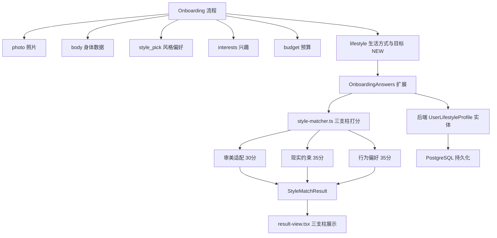

## 产品概述

在现有穿搭推荐平台 StyleMate 的基础上，将用户画像从"身材+长相+性格"三维扩展为"审美适配 + 现实约束 + 行为偏好"三支柱体系。核心理念："适合"不等于"会穿"——一个人适合法式不代表愿意天天穿法式，适合极简不代表预算支持高质感极简单品。推荐结果需要同时考虑审美匹配度、现实条件约束和行为偏好倾向。

## 核心功能

- **新增画像维度采集**：在 onboarding 流程中新增"生活方式与目标"步骤，收集年龄段、职业/使用场景（选填）、所在城市/气候（选填）、月度穿搭预算、穿衣目标、风格接受度（选填）、是否愿意尝试新风格（选填）、对舒适度/显瘦/质感/个性表达的优先级排序
- **三支柱打分体系**：将风格匹配引擎从当前 6 维扁平打分重构为三支柱加权体系——审美适配（体型+肤色）、现实约束（预算+难度+年龄+职业+气候）、行为偏好（风格偏好+穿衣目标+兴趣+优先级+接受度），总览分数仍为 100 分
- **丰富画像展示**：结果页展示完整的三支柱画像卡片和分组得分拆解，让用户理解"为什么推荐这个风格"
- **后端持久化**：新建 UserLifestyleProfile 实体，支持画像数据的存储与查询

## 技术栈

- **前端**：Next.js 14 + TypeScript + TailwindCSS + shadcn/ui（现有栈，无变更）
- **后端**：NestJS + TypeORM + PostgreSQL（现有栈，新增实体）
- **共享类型**：packages/shared/src/index.ts（现有，扩展类型）
- **匹配引擎**：前端规则打分 style-matcher.ts（现有，重构打分逻辑）

## 实现方案

### 整体策略

在现有 5 步 onboarding 流程（photo → body → style_pick → interests → budget）后新增第 6 步"lifestyle"，收集全部新增维度。同时将 style-matcher.ts 的 6 维扁平打分重构为三支柱加权体系。所有新增类型在 packages/shared 统一定义，前端 onboarding-types.ts 引用并扩展，后端新建 TypeORM 实体对应存储。

### 三支柱打分体系设计

当前打分：bodyShape(25) + preference(25) + difficulty(20) + budget(15) + interests(10) + skinTone(5) = 100

重构后三支柱：

| 支柱 | 维度 | 分值 | 说明 |
| --- | --- | --- | --- |
| **审美适配 (30)** | bodyShape | 0-25 | 体型廓形适配（保留） |
|  | skinTone | 0-5 | 肤色色系适配（保留） |
| **现实约束 (35)** | budgetFit | 0-15 | 预算+难度综合（合并原 budget+difficulty） |
|  | ageFit | 0-8 | 年龄段适配（新增） |
|  | occupationFit | 0-7 | 职业/场景适配（新增） |
|  | climateFit | 0-5 | 气候适配（新增） |
| **行为偏好 (35)** | preference | 0-12 | 风格偏好（降权，原 25） |
|  | dressingGoals | 0-10 | 穿衣目标匹配（新增） |
|  | interests | 0-5 | 兴趣关联（降权，原 10） |
|  | priorityFit | 0-5 | 优先级排序匹配（新增） |
|  | styleAcceptance | 0-3 | 风格接受度调节（新增） |


### 新增映射表设计

匹配引擎将新增以下映射表（与现有 BODY_SILHOUETTE_MAP、INTEREST_STYLE_MAP 同模式）：

- **AGE_STYLE_MAP**：年龄段 → 偏好风格 category 列表（如 18_24 → 街头潮流/韩系/运动休闲；31_40 → 职场精英/质感主义/英伦）
- **OCCUPATION_STYLE_MAP**：职业 → 偏好风格 category 列表（如 office_worker → 职场精英/法式/日系；creative_professional → 文化艺术/街头潮流/亚文化）
- **CLIMATE_STYLE_MAP**：气候 → 偏好风格 category 列表（如 cold → 北欧/英伦/暗黑；hot_humid → 休闲度假/运动休闲/极简）
- **GOAL_STYLE_MAP**：穿衣目标 → 偏好风格 category 列表（如 workplace_appropriate → 职场精英/英伦/质感主义；self_expression → 亚文化/街头潮流/色彩美学）
- **PRIORITY_ATTRIBUTE_MAP**：优先级关键词 → 风格属性偏好（如 comfort → difficulty<=2 + 宽松廓形；quality → 质感主义 category；personality → 亚文化/色彩美学/暗黑）

### 性能与可靠性

- 匹配引擎仍为纯前端规则计算，80 种风格 × 新增打分函数，每次 matchStyles 调用复杂度 O(n × m)，n=80 风格，m≈10 打分维度，无性能瓶颈
- 新增映射表均为静态常量，无运行时开销
- 后端新增实体使用 `synchronize: true` 自动建表（与现有模式一致），无需手写 migration

## 实现注意事项

- **向后兼容**：现有 OnboardingAnswers 的字段不能删除，只能新增；StyleMatchResult.matchBreakdown 需同步更新类型定义，result-view.tsx 的 MiniBar 展示需适配新结构
- **可选字段处理**：职业、城市/气候、风格接受度、尝试意愿为选填，onboarding 步骤允许跳过；匹配引擎对 null/undefined 值给中性分数（类似现有 `if (!budget) return 8` 模式）
- **优先级排序交互**：4 个优先级项（舒适度/显瘦/质感/个性表达）使用点击排序——用户按优先级依次点击，显示序号标记，支持重新排序
- **颜色体系一致性**：新组件必须复用现有 `ink-*`/`creme-*` Tailwind 色系和 `font-display` 字体类，不引入新色系

## 架构设计



## 目录结构

### 修改文件清单

```
cleanfit/
├── packages/shared/src/
│   └── index.ts                                    # [MODIFY] 新增 UserLifestyleProfile 接口及 AgeRange/Occupation/ClimateType/DressingGoal/StyleAcceptance/PriorityKey/MonthlyBudgetRange 类型定义
├── services/api/src/modules/user/
│   ├── entities/
│   │   └── user-lifestyle-profile.entity.ts        # [NEW] TypeORM 实体，表 user_lifestyle_profiles，存储全部新增画像维度
│   ├── user.module.ts                              # [MODIFY] 注册 UserLifestyleProfile 实体到 TypeOrmModule.forFeature
│   └── user.service.ts                             # [MODIFY] 新增 updateLifestyleProfile 方法 + getUserProfile 返回 lifestyleProfile
├── apps/web/src/lib/
│   ├── onboarding-types.ts                         # [MODIFY] 新增前端类型/选项常量(AGE_OPTIONS/OCCUPATION_OPTIONS/CLIMATE_OPTIONS/GOAL_OPTIONS/PRIORITY_OPTIONS/ACCEPTANCE_OPTIONS)，扩展 StepId/OnboardingAnswers/createDefaultAnswers，更新 StyleMatchResult.matchBreakdown 结构
│   └── style-matcher.ts                            # [MODIFY] 重构为三支柱打分体系，新增 AGE_STYLE_MAP/OCCUPATION_STYLE_MAP/CLIMATE_STYLE_MAP/GOAL_STYLE_MAP/PRIORITY_ATTRIBUTE_MAP 映射表及对应打分函数
├── apps/web/src/components/onboarding/
│   ├── lifestyle-step.tsx                          # [NEW] 生活方式与目标采集组件，包含年龄段选择、职业选择(选填)、城市输入(选填)、穿衣目标多选、优先级排序、风格接受度(选填)、尝试意愿(选填)
│   └── result-view.tsx                             # [MODIFY] 更新画像卡片展示新增维度，MiniBar 改为三支柱分组展示
└── apps/web/src/app/onboarding/
    └── page.tsx                                    # [MODIFY] STEPS 数组新增 lifestyle 步骤，step===5 渲染 LifestyleStep，handleSubmit 传递新字段
```

## 关键代码结构

### UserLifestyleProfile 共享接口

```typescript
/** 年龄段 */
export type AgeRange = 'under_18' | '18_24' | '25_30' | '31_40' | '41_50' | 'over_50';

/** 职业/使用场景 */
export type Occupation =
  | 'student' | 'office_worker' | 'creative_professional' | 'freelancer'
  | 'manager_executive' | 'tech_engineering' | 'education_research'
  | 'medical_healthcare' | 'service_industry' | 'self_employed' | 'other';

/** 气候类型 */
export type ClimateType = 'cold' | 'temperate' | 'warm' | 'hot_humid' | 'dry';

/** 穿衣目标 */
export type DressingGoal =
  | 'workplace_appropriate' | 'daily_casual' | 'dating_social'
  | 'self_expression' | 'comfort_first' | 'slimming_effect'
  | 'quality_upgrade' | 'trend_fashionable';

/** 风格接受度 */
export type StyleAcceptance = 'conservative' | 'moderate' | 'open' | 'adventurous';

/** 优先级关键词 */
export type PriorityKey = 'comfort' | 'slimming' | 'quality' | 'personality';

/** 用户生活方式画像 */
export interface UserLifestyleProfile {
  id: string;
  userId: string;
  ageRange: AgeRange | null;
  occupation?: Occupation | null;
  city?: string | null;
  climate?: ClimateType | null;
  monthlyBudget?: string | null;
  dressingGoals: DressingGoal[];
  styleAcceptance?: StyleAcceptance | null;
  willingToTryNewStyles?: boolean | null;
  priorityRanking: PriorityKey[];
}
```

### 三支柱 matchBreakdown 结构

```typescript
/** 风格匹配得分拆解 — 三支柱体系 */
export interface MatchBreakdown {
  // 审美适配 (30分)
  bodyShape: number;       // 0-25
  skinTone: number;        // 0-5
  // 现实约束 (35分)
  budgetFit: number;       // 0-15
  ageFit: number;          // 0-8
  occupationFit: number;   // 0-7
  climateFit: number;      // 0-5
  // 行为偏好 (35分)
  preference: number;      // 0-12
  dressingGoals: number;   // 0-10
  interests: number;       // 0-5
  priorityFit: number;     // 0-5
  styleAcceptance: number; // 0-3
}
```

## 设计方案

新增 onboarding "生活方式与目标"步骤，复用现有 onboarding 设计语言：白色圆角卡片（rounded-3xl + shadow-xl）、ink/creme 暖色调体系、font-display 标题字体、shadcn Button 组件。步骤内按区块纵向排列，必填/选填通过标签区分，选填项标注"选填"灰色标签。优先级排序采用点击编号交互——4 个卡片初始无序号，用户依次点击分配 1-4 优先级，已排序项显示序号徽章，再次点击取消重新排序。整体风格保持温暖、简洁、高级感，与现有 5 步 onboarding 视觉完全一致。

### 页面区块设计（生活方式与目标步骤）

1. **年龄段选择区**：标题"你的年龄段" + 6 个紧凑卡片横排（18岁以下/18-24/25-30/31-40/41-50/50+），单选，选中态 ink-800 背景
2. **职业/使用场景区**：标题 + "选填"标签，8-10 个图标卡片网格，单选，含"其他"选项
3. **所在城市区**：标题 + "选填"标签，单行文本输入框，creme-100 背景，placeholder"如：上海"
4. **穿衣目标区**：标题"你的穿衣目标" + 副标题"可多选，最多3项"，8 个卡片网格多选，已选数量计数器
5. **优先级排序区**：标题"对你来说最重要的是？" + 4 个可点击卡片（舒适度/显瘦/质感/个性表达），点击分配优先级序号徽章
6. **风格接受度 + 尝试意愿区**：标题 + "选填"标签，4 级接受度单选卡片 + 尝试新风格开关切换，紧凑横排
7. **导航按钮区**：左侧"上一步"，右侧"查看结果"（必填项完成时激活）

## Agent Extensions

### SubAgent

- **code-reviewer**
- Purpose: 审查重构后的三支柱打分引擎、新增 TypeORM 实体、扩展的 onboarding 类型定义的代码正确性与一致性
- Expected outcome: 确认类型定义前后端对齐、打分逻辑无遗漏、可选字段 null 处理完备、现有功能无回归