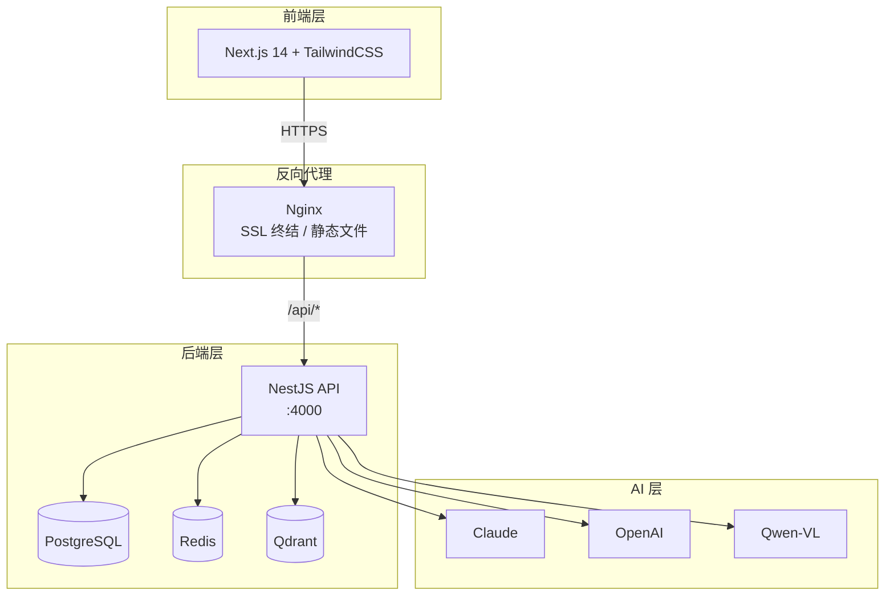
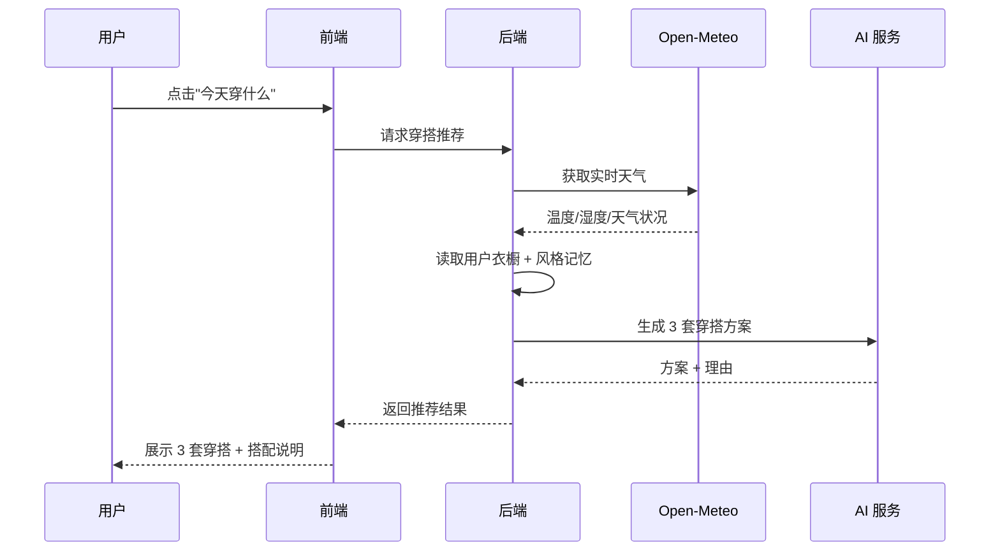

<div align="center">
  <br/>
  
  <br/>
  <h1>StyleMate · AI 穿搭助手</h1>
  <p>
    <strong>从风格灵感、个人测评到每日穿搭，帮你完成从买到穿的无痛闭环</strong>
  </p>
  <p>
    <a href="https://github.com/guanwei1117-ctrl/cleanfit/blob/main/LICENSE">
      
    </a>
    <a href="https://nextjs.org/">
      
    </a>
    <a href="https://nestjs.com/">
      
    </a>
    <a href="https://www.typescriptlang.org/">
      
    </a>
    <a href="https://turbo.build/">
      
    </a>
    <a href="https://tailwindcss.com/">
      
    </a>
    <br/>
    
    
    
  </p>
  <br/>
</div>

---

## ✨ 特性一览

<table>
<tr>
<td width="33%">

### 🎯 风格测评
三步完成风格画像：填基础信息 → AI 对话式深度了解 → 生成 80 种风格档案

</td>
<td width="33%">

### 📸 穿搭诊断
上传穿搭照片，AI 从 8 个维度评分 + 改良建议 + 衣橱替换方案

</td>
<td width="33%">

### 🌤️ 每日穿搭
结合实时天气、衣橱和风格记忆，AI 每天为你生成 3 套穿搭方案

</td>
</tr>
<tr>
<td width="33%">

### 👔 智能衣橱
拍照自动识别品类/颜色/材质/风格，AI 帮你搭、帮你分析缺口

</td>
<td width="33%">

### 🛒 购物清单
缺口分析 → 一键加入购物清单 → 多平台比价（淘宝/京东/拼多多）

</td>
<td width="33%">

### 🧠 记忆系统
长期画像 + 行为反馈 + 当前意图，AI 越来越懂你的风格偏好

</td>
</tr>
</table>

---

## 🏗️ 系统架构



---

## 🚀 快速开始

**前置条件：** [Docker Desktop](https://www.docker.com/products/docker-desktop/) · [Node.js](https://nodejs.org/) ≥ 18 · [Python](https://python.org/) ≥ 3.8

```bash
# 1. 安装依赖
npm install

# 2. 一键启动（自动拉起数据库 + 前后端）
python start.py
```

启动后访问：
| 服务 | 地址 |
|------|------|
| Web 前端 | http://localhost:3000 |
| API 文档 | http://localhost:4000/api/docs |

> 详细启动说明见下方 [📖 使用指南](#-使用指南)

---

## 🎬 核心功能展示

### 🎯 风格测评 — 三步找到你的风格

```
Step 1: 基础信息     →    Step 2: AI 对话     →    Step 3: 风格档案
┌──────────────┐        ┌──────────────┐        ┌──────────────┐
│ 性别 / 身高   │        │ AI 逐步了解    │        │ 80 种风格     │
│ 体重 / 职业   │ ────→  │ 风格偏好 / 雷区 │ ────→  │ 匹配 Top 3    │
│ 城市 / 场景   │        │ 预算 / 舒适度  │        │ 详细报告      │
└──────────────┘        └──────────────┘        └──────────────┘
```

### 📸 穿搭诊断 — 8 维 AI 评分

| 维度 | 说明 |
|------|------|
| 🎨 **色彩搭配** | 整体配色协调性分析 |
| 📐 **比例廓形** | 上下身比例、服装廓形匹配度 |
| 🏷️ **风格一致性** | 单品风格是否统一 |
| 👔 **单品匹配** | 各单品之间的搭配度 |
| 🌟 **场合适配** | 是否符合目标场景 |
| 🔄 **衣橱替换** | 问题单品 → 衣橱可替换选择 |
| 📊 **综合评分** | 整体穿搭评分 |
| 💡 **改良建议** | 具体可执行的改进方向 |

### 🌤️ 今日穿搭推荐流程



---

## 🛠️ 技术栈

| 层级 | 技术 | 用途 |
|------|------|------|
| **Web 前端** | Next.js 14 + TypeScript + TailwindCSS | 响应式 SPA |
| **后端 API** | NestJS 10 + TypeScript | RESTful API |
| **数据库** | PostgreSQL + TypeORM | 用户数据持久化 |
| **缓存** | Redis | 会话 / 限流 |
| **向量检索** | Qdrant | 以图搜图 |
| **AI 推理** | Claude / OpenAI / Qwen-VL | 穿搭分析 / 推荐 |
| **包管理** | npm workspaces + Turborepo | Monorepo 编排 |

---

## 📦 项目结构

```text
stylemate/
├── apps/
│   └── web/                    # Next.js Web 前端
│       ├── src/
│       │   ├── app/            # 页面路由
│       │   ├── components/     # UI 组件
│       │   └── lib/            # API 客户端 + 工具函数
│       └── public/             # 静态资源
├── packages/
│   └── shared/                 # 共享类型定义
├── services/
│   └── api/                    # NestJS 后端 API
│       ├── src/
│       │   ├── modules/        # 功能模块
│       │   └── common/         # 公共守卫/工具
│       └── Dockerfile
├── docs/                       # 文档
├── docker-compose.yml          # 开发环境
├── docker-compose.prod.yml     # 生产环境
├── nginx.conf                  # Nginx 配置
└── start.py                    # 一键启动脚本
```

---

## 📖 使用指南

<details>
<summary><strong>🖥️ 手动启动（点击展开）</strong></summary>

### 1. 安装依赖

```bash
npm install
```

### 2. 配置环境变量

```bash
cp .env.example .env
```

AI 相关变量按需配置（至少一个即可）：

```env
ANTHROPIC_API_KEY=sk-ant-xxx      # Claude（推荐）
DASHSCOPE_API_KEY=sk-xxx          # 阿里云通义千问
OPENAI_API_KEY=sk-xxx             # OpenAI
```

### 3. 启动数据库

```bash
docker compose up -d postgres redis
```

### 4. 启动开发服务

```bash
npm run dev
```

> 无需数据库模式：在 `.env` 中设置 `ENABLE_DB=false` 即可。

</details>

<details>
<summary><strong>🐳 生产部署（点击展开）</strong></summary>

### 前置条件

- 服务器安装 Docker + docker compose
- 域名解析到服务器：`www.guanwei-stylemate.com` / `api.guanwei-stylemate.com`
- SSL 证书放到 `ssl/` 目录

### 部署

```bash
# 1. 配置后端环境变量
vim services/api/.env.prod

# 2. 一键部署
bash scripts/deploy.sh
```

详细部署文档见 [docs/deploy-guide.md](docs/deploy-guide.md)。

</details>

---

## 🧪 测试

```bash
npm test          # 运行所有测试
npm run lint      # TypeScript 类型检查
npm run build     # 生产构建
```

---

## 🤝 贡献指南

欢迎贡献！请先阅读 [CONTRIBUTING.md](CONTRIBUTING.md)。

1. Fork 本仓库
2. 创建特性分支：`git checkout -b feat/amazing-feature`
3. 提交变更：`git commit -m 'feat: add amazing feature'`
4. 推送分支：`git push origin feat/amazing-feature`
5. 提交 Pull Request

---

## 📄 许可证

[MIT](LICENSE) © 2024 [guanwei1117-ctrl](https://github.com/guanwei1117-ctrl)

---

<div align="center">
  <sub>
    ⭐ 如果 StyleMate 对你有帮助，欢迎 Star 支持！
    <br/>
    <a href="https://github.com/guanwei1117-ctrl/cleanfit/issues">报告 Bug</a>
    ·
    <a href="https://github.com/guanwei1117-ctrl/cleanfit/issues">功能建议</a>
    ·
    <a href=".github/FUNDING.yml">赞助</a>
  </sub>
</div>